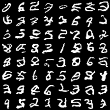
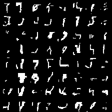

# PixelZoo
Implementation of various pixel-based autoregressive models like pixelCNN, GatedPixelCNN, ConditionalPixelCNN, PixelCNN++, and PixelSNAIL.

**Note** : The project is still in progress.

## 1. Setup Instructions and Dependencies
You may setup the repository on your local machine by either downloading it or running the following line on `terminal`.
``` Batchfile
git clone https://github.com/h3lio5/PixelZoo.git
```
All dependencies required by this repo can be downloaded by creating a virtual environment with Python 3.7 and running

``` Batchfile
python3 -m venv .env
source .env/bin/activate
pip install -r requirements.txt
pip install -e .
```
## 2. Training Instructions and Results
### PixelCNN
 * To train the model with categorical output distribution, run -
``` Batchfile 
   python train.py --model=pixelcnn --dataset=mnist --logits_dist=categorical --batch_size=256 
```
 * The model with a categorical distribution over 255 pixel values in the last layer performs much better but takes a little longer to train.
 * The model converges after training for 42 minutes with a test negative log-likelihood of 1.0783 bits/dim.
      
 * To train the model with sigmoid output distribution, run - 
``` Batchfile 
   python train.py --model=pixelcnn --dataset=mnist --logits_dist=sigmoid --batch_size=256 
```
 * The model converges after 47 minutes with a test negative log-likelihood of 1.077 bits/dim.         
      
 * I suspect that the reason the sigmoid samples are significantly worser than the categorical samples is that I trained both 
   the models with same architecture -- same number of layers. Maybe the sigmoid model gets a weaker gradient signal that is
   insufficient to train the model with large layers resulting in underfitting.


 
